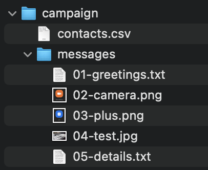
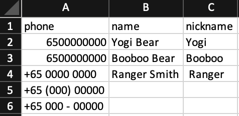
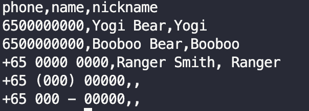

# Campaign Manager (cmgr)

A simple utility to send message on whatsapp. This is a command line tool so you have to run this in a Windows Termical on windows, or equivalen on Mac and linux.

## Quick start

Ones you have setup [pre-requisites](#prerequisites),  just run following on terminal

```bash
npx github:yogendra/cmgr
```

You may be asked for installing package (as below). confirm by typing `y`

```bash
Need to install the following packages:
  github:yogendra/cmgr
Ok to proceed? (y)
```

It can take upto 30 min first time to download all the packages, but subsequently it should be faster.

If this is the first time you are running this, you will be shown a QR code. 
On you **Mobile Device (Phone/Tablet)** 

- Go to **Whatsapp > Setting > WhatsApp Web**
- Click on **LINK A DEVICE**
- And then scan the QR code shown on screen.

This will connect this app to your whatsapp account

```bash
2021-05-15 17:11:29.654 [info] : Folder:./campaign - Campaign Start 
2021-05-15 17:11:29.665 [info] : Finished loading  1 contacts from campaign/contacts.csv 
█ ▄▄▄▄▄ █▀█▀▀▄▀█▀█▄▀▀▀█▄▀▀▄█▄▄▄ ▀▄▀█▀▄█ ▄▄▄▄▄ █
█ █   █ █▀ ▄▀█ ▄█▀  ▀▄ ▀ ▀▀█▀▄▀▄ █▄█ ▀█ █   █ █
█ █▄▄▄█ █▀▄▀▀█▀▀▄█▀▀▄ ▄▄▄ ▄▀▀ ▄ ▄█▄▄▄▄█ █▄▄▄█ █
█▄▄▄▄▄▄▄█▄▀ █ ▀▄█▄▀▄▀ █▄█ █ █ ▀▄▀ ▀ █▄█▄▄▄▄▄▄▄█
█▄▄▄▄ █▄  ▄█▀▀█▀▀▄  ▄▄   ▄ █ ▀  █▀ ▄ ▀ █ ▀ █▄██
██▀ ▀█ ▄█▄▀▄▀▀ ▄▀▀▀▄▀█▄██ █▄▀   ▀▄▀ ▀ ▀▄██▄  ██
█ ▄▄▀▄ ▄▀ ▀▄█  ██▄▄ ▄ █ █▀ ▄▄█▀▀ █▄▄▀ ▀███▄█▀ █
█▀ ▄██ ▄▄ ▄ ▀▀  ▄▀██▀█▄█▄▄ █ ▄▄ ▀▄▀▄▄ ▄  ▄▀▀▀▀█
█▄▀ ▄██▄▄▄▄█▄▀▄▀██▀▄█▀█▄ █▀█▀█▄▀▄███ ▀█▄█▀▀█ ▀█
██ ▀ ▄█▄█  ▀▄▄ █▀▄▀▀▀█▀█▀ █▄▄ █▀  ▀   ▄ █▀▄ ▄██
█▄▄▄▄ ▄▄▄ ████ █▄▄  ▀ ▄▄▄ ▀█▄█▀ ▀▀▄█  ▄▄▄ ▀▀▀▀█
█ █▀▀ █▄█ █▀▀██  ██ ▀ █▄█ █   ▀█▄ █▄▄ █▄█   ▄▀█
█ ▀█ ▄ ▄▄ █▀▄ ▄█▄▄▄ █ ▄ ▄▄ ▄▀▀ ▀ █▄▄█▄▄  ▄ ▄█▄█
██▄▀█▀█▄▀▀ ▀▄  █ █  ██▀█▀▀▀▄▄▀▄██▀▄▄ ▄▄███▀  ██
█ ██ ▀▄▄█  █▀ ▀▀█▄ ▄▀ █▀ ▀ █▄▀▄  ▀█▄▀▄ ▀█▄▄▀███
████ ▄█▄▄▄▄ █▀▀█ ▀▀██▄▄▀ ▀▄█▄▀▄▀▀█▄▀▀▄▀▀  ▀ ▄▀█
█▀▀▀▄ ▀▄▄▄▀ ▀▄▀▀██ ▄▀▄▀▀▀▀ ▄ ▀▀▀▄▀▀█▀▀█ ██    █
██▀▀▀ █▄█  ▀▀█ █▀█  █▄  ▄▀▄██▀▀  ▀▄▄▀▄ ███  ███
█▄██▄▄█▄▄▀▀ ▀▀▀▀▄█▀▄  ▄▄▄ ▀█▀█ ▀▄███▀ ▄▄▄ █▀█▄█
█ ▄▄▄▄▄ █▄▄█▀▄ ▄ ▀▀▀  █▄█ ▄ ▄ █▄ ▀▄▀▄ █▄█  ▀▄▀█
█ █   █ █ ▀▀█ ▀▀▄▄ ▄▀▄▄▄  ▀▄ ▀▀▀ ██▄▄  ▄  ▀▀▀██
█ █▄▄▄█ █  ▀ ▄█▀▀▀█▀ ▀   ▄ ▄▀███ ▀▀ ▄  █▀█  █▄█
█▄▄▄▄▄▄▄█▄████▄██▄█▄▄█▄█▄▄▄▄███▄▄██▄███▄▄▄█▄▄██

```

## Prerequisite

1. Install [NodeJS 16.1+](https://nodejs.org/en/download/)
    - Download the package and execute installer
1. [Windows Terminal](https://www.microsoft.com/en-sg/p/windows-terminal/9n0dx20hk701?rtc=1&activetab=pivot:overviewtab) **Windows Only**
    - Install from Market or Download package and execute installer
1. A campaign folder, [more info below](#campaign-folder)

## How to use it?

1. Create a [campaign folder](#campaign-folder). Example: `campaign`. For a quick start, run following command

    - Use a quick start commands to create sample campaign.

        ```bash
        npx -p github:yogendra/cmgr init-campaign
        ```

        This will create a new folder/directory named `campaign` in you current directory. You can edit `contacts.csv` or replace it with your own.
    - **TIP:** On windows, you may put it on desktop for easily running program
    - If its not on desktop that you have to provide full path of the folder
1. Start your terminal applications

1. Check NodeJS

    ```bash
    node -v
    ```

    **Output:**

    ```bash
    v16.1.0
    ```

1. Check NPX

    ```bash
    npx -v
    ```

    **Output:**

    ```bash
    7.11.2
    ```

1. Run campaign

    ```bash
    npx github:yogendra/cmgr
    ```

## Campaign Folder

A campaign folder has your contacts and messages to post.



In the example above, there are 5 messages.

[Click here to download a sample](example/campaign.zip)

### Contacts

Contacts are in a Comma Separated Values (CSV) file.

This file can be edited with Excel/Keynote/Google Sheets.


Or you can edit it in a good text editor.


This has 3 columns:

1. **phone** - (_Required_) phone number of contact. A phone number:
    - Must have ISD code. **This is a must**
    - May have a `+` in front. Example: `+65898829832`
    - May have spaces in middle: Example: `+65 8988 29832`
    - May have non-numerice characters: `+65 000 - 00000` or `+65 (000) 00000`
1. **name** - (Optional) - Name of the contact
1. **nickname** - (Optional) - Nick name of contact

Example:
|phone|name|nickname|
|-|-|-|
|6500000000|Yogi Bear|Yogi|
|+6500000000|Booboo Bear|Booboo|
|+65 0000 0000|Ranger Smith| Ranger|
|+65 (000) 00000|
|+65 000 - 00000|

[Click here to download a sample](example/campaign/contacts.csv)

### Messages

Messages are stored in files. Messages can be text or pictures.

- Text messages are stored with `txt` extensions. You can edit it using Notepad, TextEdit, etc.

- Picture messages can be send with JPG or PNG files.

**Important**: Messages are sent in the alphabatical order of the file names.
