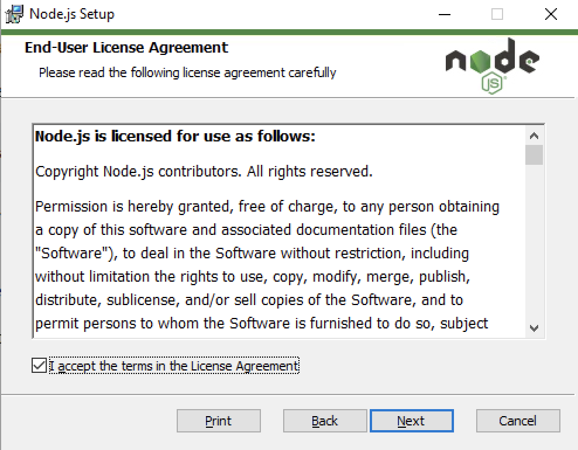
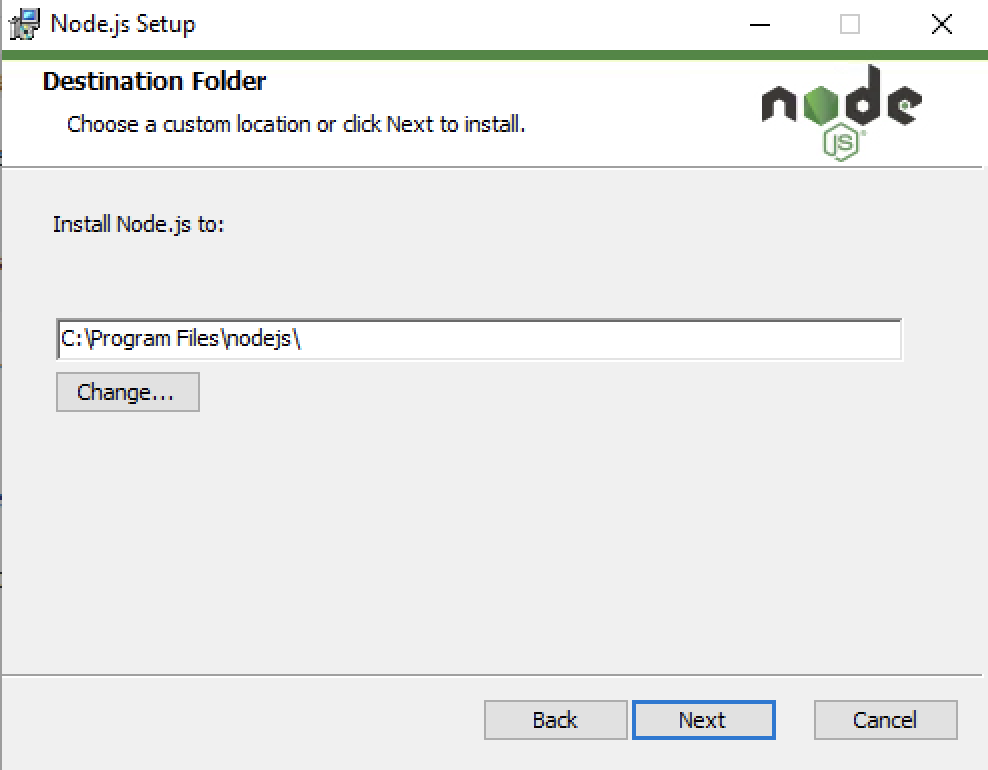
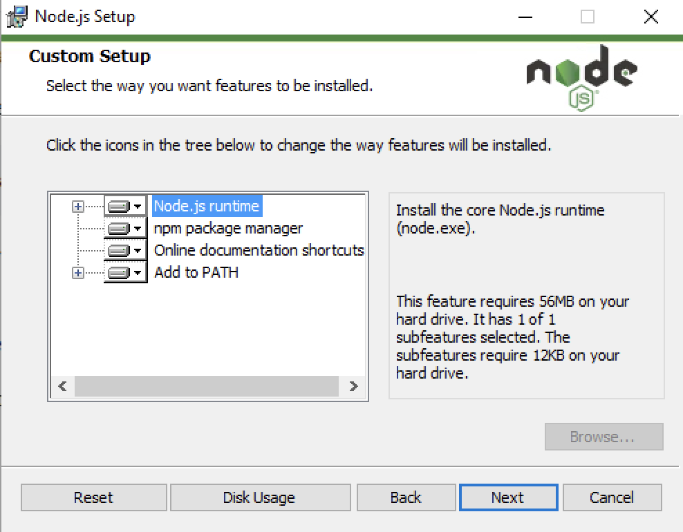
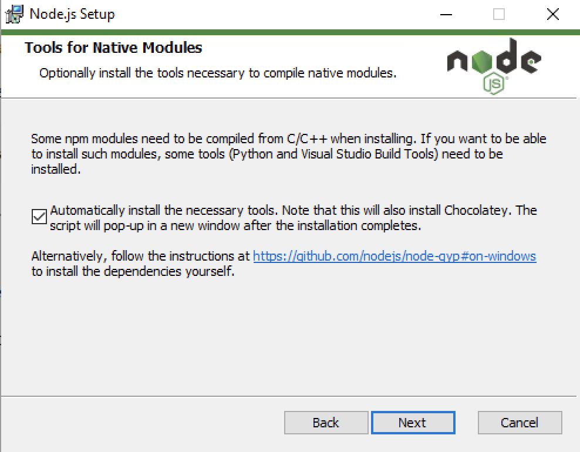
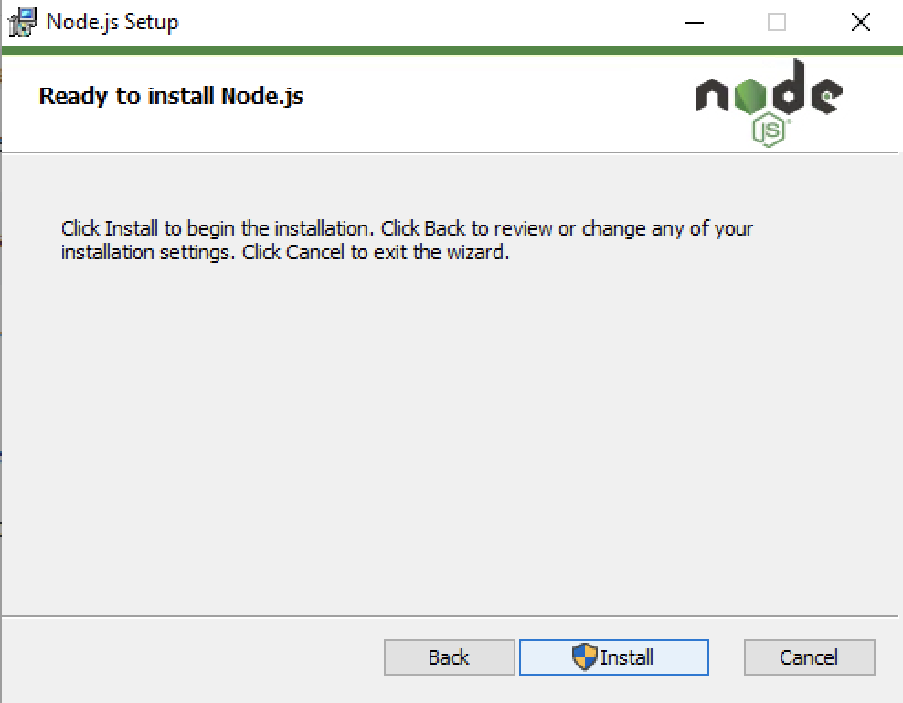

# Install NodeJS

NodeJs is free open-source javascript runtime. It can be downloaded from its [officieal site](https://nodejs.org)

## Windows

1. Download the windows package from [NodeJS site](https://nodejs.org/en/download/)
    - [Direct links](https://nodejs.org/dist/v16.1.0/node-v16.1.0-x64.msi)

1. Launch installer

1. Follow the wizard.
    - On welcom screen, click **Next**
        
    - Accept EULA by ticking checkbox at bottom and click **Next**
        
    - Select destination directory
        
    - Features selected by default are sufficient. Click **Next**
        
    - On Native Modules screen, **Select** Automatically install the neccessary tools and click **Next**
        
    - Ready to install. Click **Next**. You may get a Windows confirmation screen to allow application to escalate privilages. Approve that
        

## MacOS

1. Download the windows package from [NodeJS site](https://nodejs.org/en/download/)
    - [Direct link](https://nodejs.org/dist/v16.1.0/node-v16.1.0.pkg)
