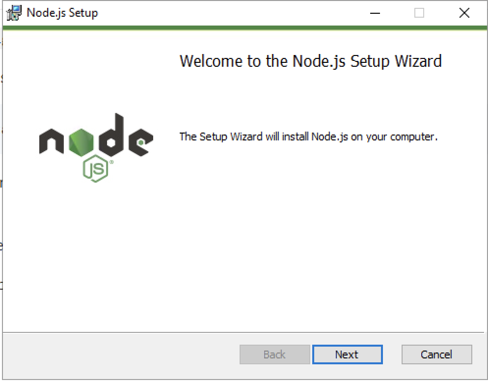

# Install NodeJS

NodeJs is free open-source javascript runtime. It can be downloaded from its [officieal site](https://nodejs.org)

## Windows

1. Download the windows package from [NodeJS site](https://nodejs.org/en/download/)
    - [Direct links](https://nodejs.org/dist/v16.1.0/node-v16.1.0-x64.msi)

1. Launch installer

1. Follow the wizard.
    - On welcom screen, click **Next**
        
    - Accept EULA by ticking checkbox at bottom and click **Next**
        
    - Select destination directory
        
    - Features selected by default are sufficient. Click **Next**
        
    - On Native Modules screen, **Select** Automatically install the neccessary tools and click **Next**
        
    - Ready to install. Click **Next**. You may get a Windows confirmation screen to allow application to escalate privilages. Approve that
        
    - Wizard will go through few steps automatically
    - There will be a command prompt for tool installation. Press any key to allow it to install
        
    - Thi will open a new PowerShell windows which installs multiple tools. It may take upto 30 min to complete.
        
    - After some time you will see following. Press ENTER to exit
    

1. Setup git
    - Lauch a terminal (Command Prompt will do)
    - Run following command
        
        ```bash
        choco install git
        ```

    - Program will ask for confirmation for running script. Type `A` and press enter.
        
    - Once setup is finished, refresh environemnt
        
        ```bash
        refreshenv
        ```

1. Check everything is setup correctly. Type following commands to check all the tools.
    - Node

        ```bash
        node -v
        ```

    - NPX

        ```bash
        npx -v
        ```

    - Git

        ```bash
        git -v
        ```

## MacOS

1. Download the windows package from [NodeJS site](https://nodejs.org/en/download/)
    - [Direct link](https://nodejs.org/dist/v16.1.0/node-v16.1.0.pkg)
